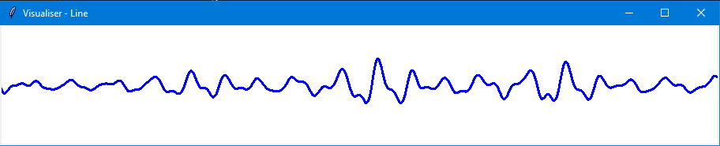

# Simple Waveform Visualiser

Uses `pyaudio` to get sound data from your microphone. Visualises with some basic options.

## Installing pyaudio

### Python 3.6-

`pip3 install pyaudio`

### Python 3.7+

There is an unofficial version which fixes a setup script for python 3.7 from: https://www.lfd.uci.edu/~gohlke/pythonlibs/#pyaudio

Download the relevant `PyAudio‑0.2.11‑cp37‑cp37m‑win*.whl` file to this directory, then run:

`pip3 install PyAudio-0.2.11-cp37-cp37m-win*.whl`

## Building for windows

You can build it as an executable for people who don't have Python installed.

```bash
pip3 install PyInstaller
pyinstaller.exe ./viewer.py
```

Creates a bunch of files and folders, the executable is `./dist/viewer/viewer.exe`, and you need to transport the whole `./dist/viewer/` folder whereever you want to run it.

## GUI settings



`Max/Min Freq.` - Used to smooth out the waveform. Real audio is quite noisy, so we remove most of the higher frequencies with the `max. freq.` setting. The lower this setting goes, the smoother and less realistic it gets.

`Width` - line width

`Gain` - multiplies the wave amplitude.

`Steepness`/`Curviness` - settings for the waveform envelope. Primarily to force the waveform envelope to be vaguely eye-shaped. Curviness defines how much the edges get pinched (1 - no tapering, 2 - tapering to the mean at the edges, 10 - essentially a sharp cut-off at a certain point), and steepness defines what proportion of the waveform gets tapered. Try setting Curviness really high (about 10) and vary steepness to get an idea of what it does.

`Momentum` - applies a momentum to the temporal aspect. Allows you to smooth out the vertical motion of the line. Less realism for a smoother line. (0 - no momentum, most realistic, shaky line, 0.95 - very slowly moving, smooth line). Suggestion: increase gain as you increase momentum.

`Min. Loud. Thresh.` - Minimum loudness threshold. If the maximum loudness is less than this value, then it just displays a flat line. 0 is the middle, 1 is the the maximum.
